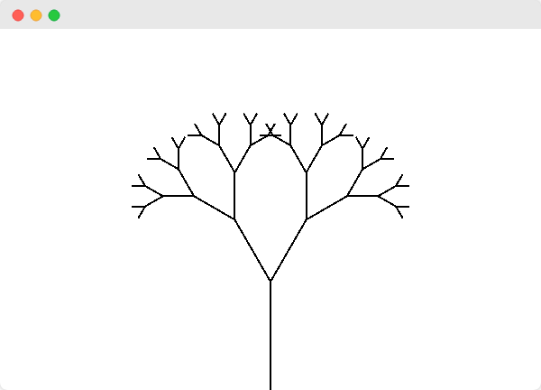

# Nature of Code - Haskell edition

[Nature of Code][noc] examples and exercises implemented in Haskell using
[gloss][gloss].



## Running examples manually

Run each sketch individually using the following command:

```
$ stack runghci src/<chapter>/<name>/Sketch.hs
```

E.g. to run the first example:

```
$ stack runghci src/Introduction/TraditionalRandomWalk/Sketch.hs
```

The README of each sketch provides its full command as well, ready to be
copy-pasted.

Gloss provides a few default keybinds to interact with the sketch:

- Quit using `ESC`
- Move around with the arrows key or by dragging the screen
- Zoom with the mousewheel, page up/down, `CTRL`+drag, right click + drag
- Rotate with `HOME`/`END` of `ALT` + left click drag
- Reset the viewport with `R`

These keybinds are not available in sketches that require interaction, or if
changing the viewport does not make sense for a specific sketch (e.g. collision
detection where the window edges act as walls).

## Overview

- [Introduction](src/Introduction/)
  - [Example I.1: Traditional random walk](src/Introduction/TraditionalRandomWalk)
  - [Example I.2: Random number distribution](src/Introduction/RandomNumberDistribution)
  - [Example I.3: Walker that tends to move to the right](src/Introduction/WalkerThatTendsToTheRight)
  - [Example I.4: Gaussian distribution](src/Introduction/GaussianDistribution)
  - [Exercise I.3: Dynamic random walker](src/Introduction/DynamicRandomWalker)
  - [Exercise I.4: Paint splatter](src/Introduction/PaintSplatter)
  - [Exercise I.5: Gaussian random walk](src/Introduction/GaussianRandomWalk)
  - [Exercise I.6: Custom distribution walker](src/Introduction/CustomDistributionWalker)
  - [Extra: Interactive perlin noise graph](src/Introduction/PerlinNoiseGraph)
- [Fractals](src/Fractals/)
  - [Example 8.6: Recurisve tree](src/Fractals/RecursiveTree)
  - [Example 8.7: Recursive tree (dynamic)](src/Fractals/DynamicRecursiveTree)

## Recordings

Recordings of the sketches are made using [SimpleScreenRecorder][ssr], as it
allows to directly record an OpenGL application.

The recording is saved as an mp4, and then converted to gif using ffmpeg. A
quick & dirty script to handle this is included:

```
$ ./gengif.sh sketch.mp4 sketch.gif
```

## Generating documentation

Documentation is not committed, this serves more as a reminder for me, as I
sometimes generate docs to check if my docblock syntax is okay.

```
$ find src/ -type f -name "*.hs" -exec stack exec -- haddock --html --pretty-html --hyperlinked-source --odir=dist/docs {} +
```

## Related

This is something I like to do to gain a better understanding of a language.
See also:

- [Nature of Code - Lisp edition][noc-lisp]
- [Nature of Code - Elm edition][noc-elm]

[noc]: http://natureofcode.com/
[gloss]: http://gloss.ouroborus.net/
[ssr]: https://www.maartenbaert.be/simplescreenrecorder/
[noc-lisp]: https://github.com/mark-gerarts/nature-of-code
[noc-elm]: https://github.com/mark-gerarts/nature-of-code-elm
