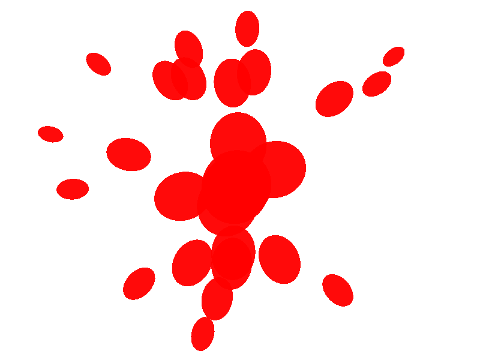

# Exercise I.4: Paint splatter

```
$ stack runghc src/Introduction/PaintSplatter/Sketch.hs
```



This was an interesting exercise for the following reasons:

- I had to figure out how to generate a list of random numbers with `random-fu`.
- I had to really understand how the different transformations in gloss work
  together (translate, scale, ...)

Further improvements can still be made by adding more randomness.
