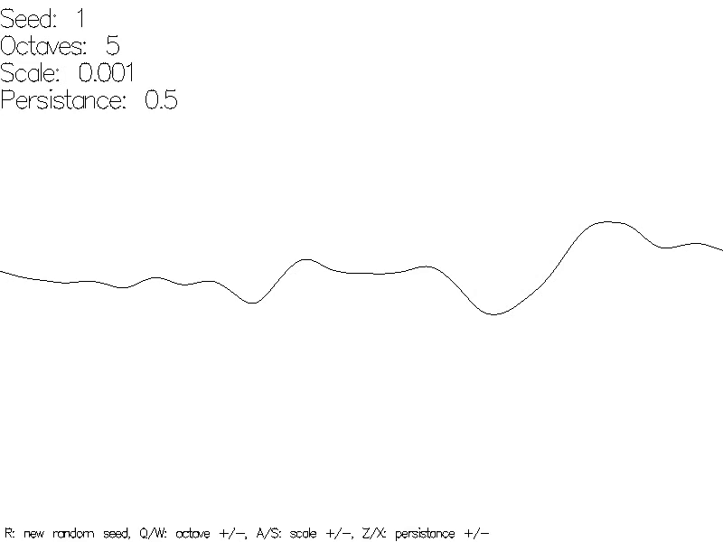

# Interactive Perlin noise graph

```
$ stack runghc src/Introduction/PerlinNoiseGraph/Sketch.hs
```



Chapter I.6 starts with a graph of 1D Perlin noise. Perlin noise is based on a
set of values:

- Octaves
- Scale
- Persistance

In this sketch you can dynamically modify these values and see the effect on the
graph.

It is not an example or exercise in the book, I just created it so I could get
a better understanding of Perlin noise.
